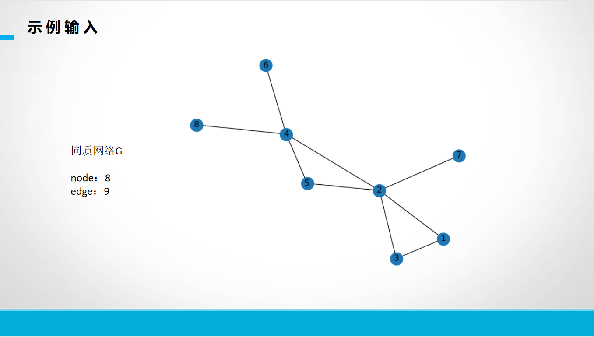
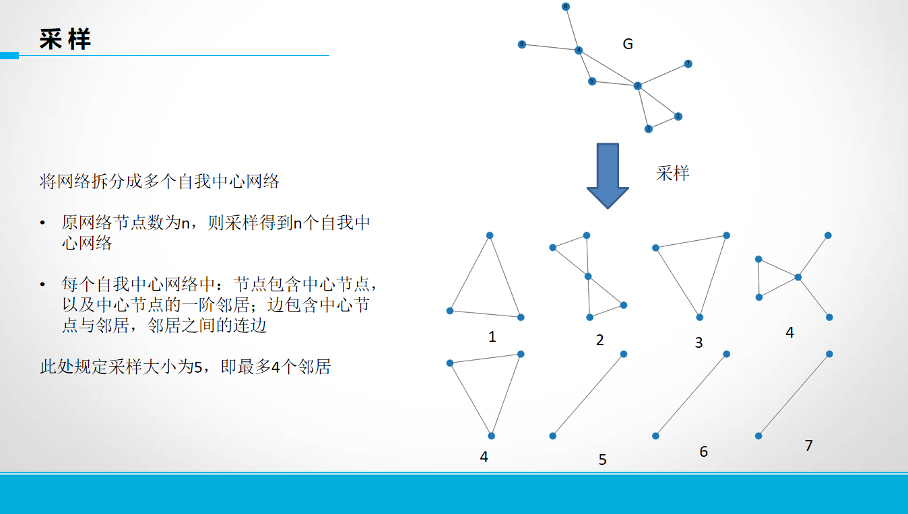
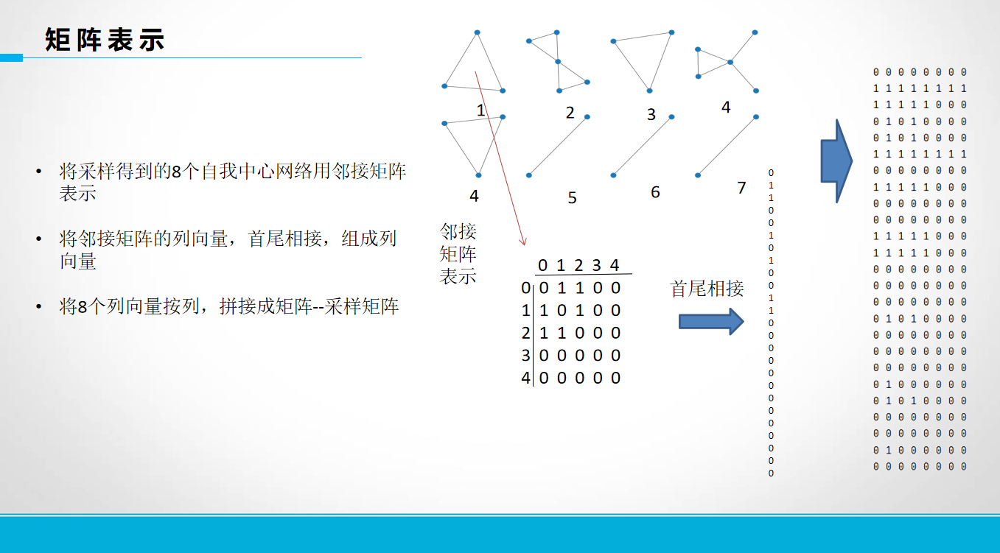
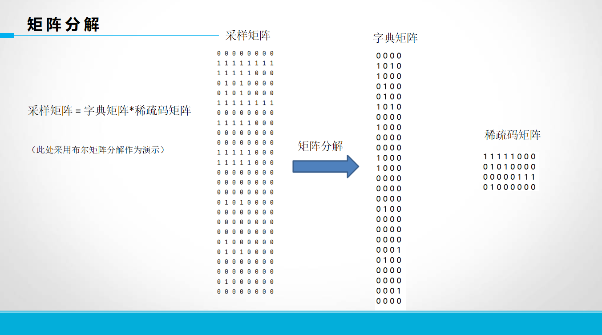
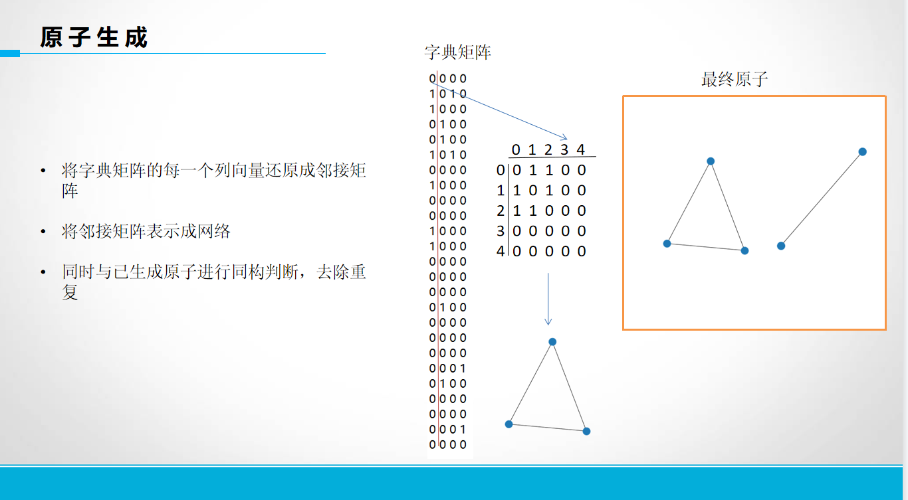
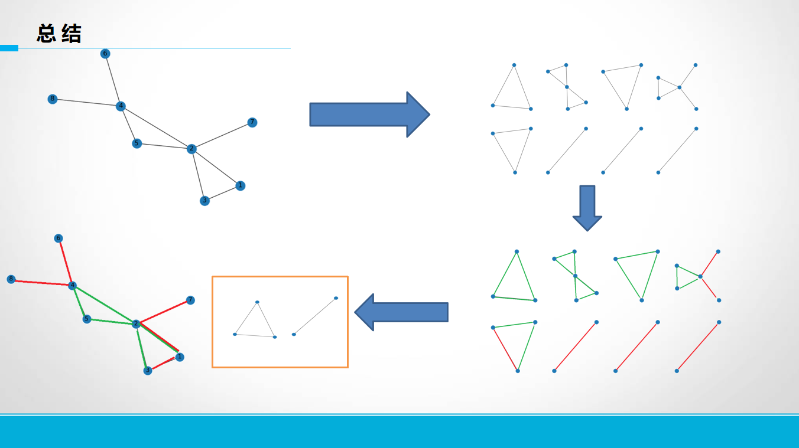

# spComponents

## 介绍
- 复杂网络稀疏表征相关tools，不断更新中

## 功能
- 网络稀疏表征
- 原子生成
- 网络恢复
- 原子排序
- 绘制原子图像（新增）
- 计算原子匹配率
- 计算稀疏表征误差
- 计算网络中边在原子中出现频次

## 如何使用
- from spComponents.sparseRepresentation import xxxx    xxx.run()
- 仿照demo，调用各个py
- 复杂网络稀疏表征过程： 采样 - 矩阵分解 - 原子生成 - 网络恢复 - 寻找原子对应的实际节点
                                                       原子排序
                                                       绘制原子图像
- 所有的非工具py，都可以直接 xxx.run(args) 运行
- 请在main py 同级目录下创建 /data/gexfs 路径，将gexf网络（networkx常用格式）放入

## attention
- 使用pycharm时，建议将spComponents的父节点 make directory as source root，否则会出现 no module named xxx
    - 非pycharm需要使用sys.path.append(spComponents的父节点路径)
- 

## 关于网络稀疏表征








(刚好做了个ppt，就放上来展示一下网络稀疏表征的流程)


## 具体情况
### sparseRepresentation
#### sample.py 
- aim: 采样
    - input: gexf文件
        - 在运行目录下创建 $data/gexfs\$，将gexf文件放入
        - 此处处理无向图，只考虑结构，不考虑权重，属性等
    - output: 
        - Sample_xxx.txt 采样矩阵，每一行为自我中心网络（需要转置） TODO 直接np.saveTxt存储
        - Index_xxx.txt 自我中心网络所对应的实际网络节点
    - args: 
        - size 采样大小
    - attention
#### ksvd.py 
- aim: 用于矩阵分解，浮点数矩阵分解
    - input: Sample_xxx.txt
    - output: 
        - dic_Sample.txt 字典矩阵，维度为 采样大小*k（ksvd设定字典列向量数）
        - coef_Sample.txt 稀疏码矩阵，维度为 k*N（网络节点数）
    - args: k 字典列向量数，原子数量上限
    - attention: 
        - python版本的ksvd是浮点数分解，且存在前几个原子包揽了大部分的误差下降，原子们的误差下降及其不均匀
        - 或者说，python版本ksvd分解出来，少量的原子就完成了网络的组成
        - 所以不建议使用该版本，建议使用matlab版ksvd

#### atomGen.py
- aim: 生成原子，恢复网络
    - input: dic_Sample.txt 
    - output: 
        - Atom_x.gexf 数量有多个，即最终原子
        - Network_recover.gexf 字典与稀疏码恢复出的网络
    - args:

#### atom2nodes.py 
- aim: 找到 原子在实际网络中的对应节点，节点按序一一对应
- input: Atom_x.gexf, dict_Sample.txt, coef_Sample.txt, indexs_xxx.txt
  - output: atom2nodes.txt
      - 
      - 每两**行**为一个原子的对应节点表示
      ```txt
    原子: 原子序号
    节点: 实际对应节点
    ```
      - 实际对应节点按照 **采样大小** 分割，每 **采样大小** 为一组
      - 一个原子，由于在原网络中可能使用多次，所以对应 多组 实际节点
      - 实际节点中，可能出现-1与0，它们不真实存在（原网络中不能存在-1与0节点）
        - -1出现位置固定，其原因在于，生成的原子节点并连续，为了处理方便，使用-1对不连续部分进行填充
        - 0出现位置不固定，不一定出现，其原因在于，采样时生成自我中心网络，可能中心点的度<采样大小，为了保证自我中心网络规模一致便于矩阵运算，于是使用0作为虚拟节点进行填充；同时，由于使用ksvd浮点数分解进行使用，所以原子可能比实际结构多了一些边与点，所以存在index中实际节点、边 不存在，而原子中点与边存在的情况
- args:
- attention: 
#### calcAtomMatch.py
- aim: 计算原子在网络中的真实匹配率
- input: 
- output:
- args:
#### atomSortByError.py
- aim: 
  - 对原子进行排序
  - 排序依据为，每个原子对于矩阵分解过程中，导致误差下降了多少
- input: 
  - Sample_xxx.txt
  - dic_Sample.txt
  - coef_Sample.txt
- output:
  - 直接print排序信息 （TODO 保存在txt中）
  - 
  - 50%意为，实现误差覆盖50%的原子序号，即从1号原子到72号原子一共完成50%的误差覆盖
- args:
- attention:
  - 排序的依据是每个原子单独的误差下降
  - 两个原子的误差下降并不是x+y，而是最大值是x+y，因为两个原子的误差下降会有些许的叠加，即$|x|or|y|<=x+y<=|x|+|y|$
  - 这里的排序只能当做参考，并不绝对可靠
#### atomSortByUses.py
- aim: 
  - 对原子进行排序
  - 排序依据为 原子的使用次数 （即稀疏码的行和）
- input: 
- output:
- args:

#### plotAtoms.py
- aim: 
  - 对原子进行绘制，输出png
- input: Atom_xxx.gexf
- output: atomFig_x.png
- args: 
    - 输入一个三位数整数 xy1 
    - x 为行数，y为列数， 最后一个数必须为1
    - 每个数，最多不能超过10，超过10，就有歧义，没法识别简写模式
    
#### edgeFreq.py
- aim: 
  - 计算网络中边在原子中出现频次
- input: 网络稀疏表征所有结果，包含 原始网络gexf、atom2nodes、、、
- output: {"u_v":freq} 
- args: 
    - name: 网络名称
    - sampleSize: 网络采样大小
    