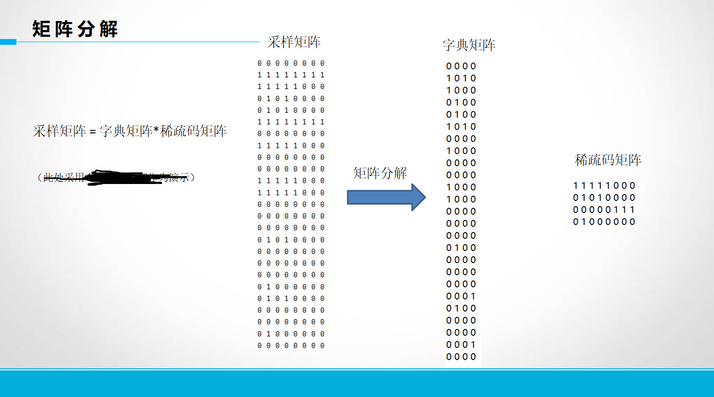

# spComponents

## 介绍
- 复杂网络稀疏表征相关tools，不断更新中
- 网络稀疏表征具体介绍 见 文末

## 功能
- 网络稀疏表征 
- 原子生成
- 网络恢复
- 原子排序
- 绘制原子图像
- 计算原子匹配率
- 计算稀疏表征误差
- 计算网络中边在原子中出现频次 （新增）
- 布尔矩阵分解

（详细说明见下方功能介绍）

## 如何使用
- from spComponents.sparseRepresentation import xxxx    xxx.run()
- 仿照demo，调用各个py
- 复杂网络稀疏表征过程： 采样 - 矩阵分解 - 原子生成 - 网络恢复 - 原始网络中原子对应的实际节点-原始网络中边数频次统计
                                                       原子排序
                                                       绘制原子图像
- 所有的非工具py，都可以直接 xxx.run(args) 运行
- 请在main py 同级目录下创建 /data/gexfs 路径，将gexf网络（networkx常用格式）放入
- ksvd_matlab
    - 该文件为ksvd的matlab版本,使用方法如下
    - 本步骤只是代替矩阵分解操作
    ```text
    下载ksvd-matlab,打开matlab进入Compressed_sensing/
    将ompbox与Ron Rubingstein右键 添加到路径-文件夹与子文件
    然后将采样后的sample文件拷贝到当前目录下,打开run.m
    修改原子个数,原子大小,训练样本路径
    运行后,会产生dic_Sample.txt与coef_Sample.txt
    拷贝出去,可以继续使用python代码执行原子生成等后序操作
    ```

## attention
- 使用pycharm时，建议将spComponents的父节点 make directory as source root，否则会出现 no module named xxx
- 非pycharm需要使用sys.path.append(spComponents的父节点路径)
- 运行的main.py 最好位于spComponents外 


## 功能介绍
### 网络稀疏表征sparseRepresentation
#### 采样
- py: sample.py 
    - input: gexf文件
        - 在运行目录下创建 $data/gexfs\$，将gexf文件放入
        - 此处处理无向图，只考虑结构，不考虑权重，属性等
    - output: 
        - Sample_xxx.txt 采样矩阵，每一行为自我中心网络（需要转置） TODO 直接np.saveTxt存储
        - Index_xxx.txt 自我中心网络所对应的实际网络节点
    - args: 
        - size 采样大小
    - attention
#### 浮点数矩阵分解
- py: ksvd.py 
    - input: Sample_xxx.txt
    - output: 
        - dic_Sample.txt 字典矩阵，维度为 采样大小*k（ksvd设定字典列向量数）
        - coef_Sample.txt 稀疏码矩阵，维度为 k*N（网络节点数）
    - args: k 字典列向量数，原子数量上限
    - attention: 
        - python版本的ksvd是浮点数分解，且存在前几个原子包揽了大部分的误差下降，原子们的误差下降及其不均匀
        - 或者说，python版本ksvd分解出来，少量的原子就完成了网络的组成
        - 所以不建议使用该版本，建议使用matlab版ksvd

#### 生成原子，恢复网络
- py: atomGen.py
- input: dic_Sample.txt 
- output: 
    - Atom_x.gexf 数量有多个，即最终原子
    - Network_recover.gexf 字典与稀疏码恢复出的网络
- args:

#### 原始网络中原子对应的实际节点
- py: atom2nodes.py
- input: Atom_x.gexf, dict_Sample.txt, coef_Sample.txt, indexs_xxx.txt
- output: atom2nodes.txt
  - 
  - 每两**行**为一个原子的对应节点表示
  ```txt
原子: 原子序号
节点: 实际对应节点
```text
  - 实际对应节点按照 **采样大小** 分割，每 **采样大小** 为一组
  - 一个原子，由于在原网络中可能使用多次，所以对应 多组 实际节点
  - 实际节点中，可能出现-1与0，它们不真实存在（原网络中不能存在-1与0节点）
    - -1出现位置固定，其原因在于，生成的原子节点并连续，为了处理方便，使用-1对不连续部分进行填充
    - 0出现位置不固定，不一定出现，其原因在于，采样时生成自我中心网络，可能中心点的度<采样大小，为了保证自我中心网络规模一致便于矩阵运算，于是使用0作为虚拟节点进行填充；同时，由于使用ksvd浮点数分解进行使用，所以原子可能比实际结构多了一些边与点，所以存在index中实际节点、边 不存在，而原子中点与边存在的情况 
  - 关于atom2nodes存在的问题
    - 向量能够覆盖所有的边，而原子并不一定能够覆盖所有的边，原因在于，字典向量与原子的转换是有损失的，所以导致不少的边找不到，因此atom2nodes并不完整
    - TODO 通过字典矩阵与原子的映射关系，来获取原子的真实使用情况才是更合理的方法，但这并不能准确对应到具体的结构，因此，实际问题还是在于KSVD产生的浮点数无法对应原子这个核心点
```
- args:
- attention: 
#### 计算原子在网络中的真实匹配率
- py: calcAtomMatch.py
- input: 
- output:
- args:
#### 按误差贡献对原子进行排序
- py: atomSortByError.py
  - 排序依据为，每个原子对于矩阵分解过程中，导致误差下降了多少
- input: 
  - Sample_xxx.txt
  - dic_Sample.txt
  - coef_Sample.txt
- output:
  - 直接print排序信息 （TODO 保存在txt中）
  - 
  - 50%意为，实现误差覆盖50%的原子序号，即从1号原子到72号原子一共完成50%的误差覆盖
- args:
- attention:
  - 排序的依据是每个原子单独的误差下降
  - 两个原子的误差下降并不是x+y，而是最大值是x+y，因为两个原子的误差下降会有些许的叠加，即$|x|or|y|<=x+y<=|x|+|y|$
  - 这里的排序只能当做参考，并不绝对可靠
#### 按使用次数对原子排序
- py: atomSortByUses.py
  - 对原子进行排序
  - 排序依据为 原子的使用次数 （即稀疏码的行和）
- input: 
- output:
- args:

#### 对原子进行绘制
- py: plotAtoms.py
- input: Atom_xxx.gexf
- output: atomFig_x.png
- args: 
    - 输入一个三位数整数 xy1 
    - x 为行数，y为列数， 最后一个数必须为1
    - 每个数，最多不能超过10，超过10，就有歧义，没法识别简写模式
    
#### 计算原始网络中边在原子中出现频次
- py: edgeFreq.py
- input: 网络稀疏表征所有结果，包含 原始网络gexf、atom2nodes、、、
- output: {"u_v":freq} 
- args: 
    - name: 网络名称
    - sampleSize: 网络采样大小
- 关于边重复出现的原因分析
    - 首先，采样大小设为s，一般是要保证至少大于网络平均度的（为了不丢失边）
    - 采样网络数目为N，至少包含的边为：中心节点--一阶邻居
    - 除此之外，可能存在于一阶邻居之间的连边（对于我们所用的**传播网络**，基本很少、甚至不存在一阶邻居的连边）。因此总边数的区间是 [|E|，s-1 *N+x]，由于s大于平均度，那么必定是大于原始网络边数目的，即使出现两个大度点相邻的情况丢失边，也基本成立，且当网络中节点度均匀时，区间可近似为 [2|E|,s-1 * N + x]；然后上限是没有虚拟节点的情况，且加上一阶邻居间的连边数X（不确定值，可能为0）
    - 因此，本身在我们进行采样之后，其中有相当多的边，被分别以该边两端节点为中心节点采样时，采样了两次。于是大部分边就已经**重复了一次**。
    - 除此之外，会存在某条边被重复采样，举这样的例子，某条边的两个端点为1,2。这两个节点分别是a、b、c、d四个节点的一阶邻居，且这四个节点度不大。那么分别以abcd为中心点来进行采样，都会将1、2采样进来，那么在这里边 (1,2)就会被采样四次。**从而重复了多次**
    - 除此之外，在进行矩阵分解时，为了构建矩形，可能会把这个矩形中的少数0变成1。当然，这是在每轮迭代中都可能发生的，此时对于这些由0变1的元素，它们实际就是边，每变一次，**就会重复一次**
    - 以上是重复边出现的 三个 原因 （目前所能想到的所有情况）
    
    
### tools 工具
- 加载网络中相关数据
- 计算矩阵分解误差
- 绘制饼状图、柱状图
- 处理文件目录
- 进程池

### 网络稀疏表征sparseRepresentation
- 布尔矩阵分解
- runBMF使用
- 使用多进程加速
- 使用矩阵编码剪枝从而加速
    
## 关于网络稀疏表征





(刚好做了个ppt，就放上来展示一下网络稀疏表征的流程)